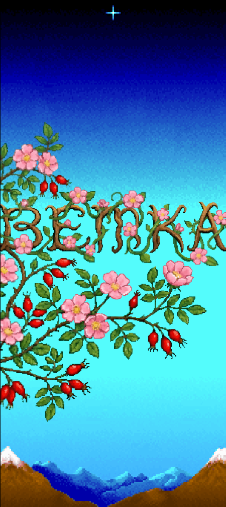
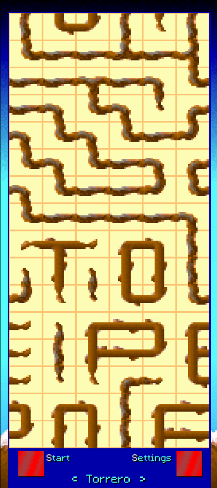
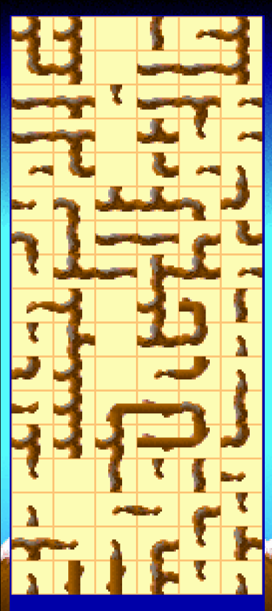
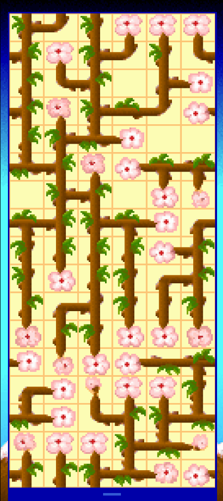

# Vetka 1992

A mobile recreation of **Ветка** (*Branch*, 1992), a Russian DOS abandonware puzzle game.

The original is long gone from everywhere except [Archive.org](https://archive.org/details/msdos_Vetka_1992), the developers were unreachable.

It's rebuilt from scratch in Godot 4.3 for Android, featuring hand-drawn pixel art animations, remade fonts, UI, some updated graphics, and a bunch of 2026 enhancements. Most of them can be toggled off.

---

## Screenshots

<video src="screenshots/video_1.mp4" height="600" controls></video>

<table>
  <tr>
	<td></td>
	<td></td>
	<td></td>
	<td></td>
  </tr>
</table>

## What is it?

Vetka is a relaxing tile-rotation puzzle game, similar to Pipe Dream / Pipe Fever. You have a grid of branch-shaped tiles, and your job is to rotate them so every bud on the grid connects back to the root to form one complete tree.

Having played it as a little kid, I was glued to the screen, spending hours and hours clicking on the branches to see them flower. I was SO sure I was making a sakura tree bloom, but it's actually a rose bush with the little rose hips! This game has some kind of a relaxing, zen vibe that other games in this genre are missing. 

Tap a tile to rotate it. That's pretty much it.

**Six difficulty levels** as the original, differing in grid size. On the hardest level, opposite edges of the grid wrap around, and the field becomes non-edged; making it a "torus".

---

## Status

> Version **0.85.0** — core mechanics are complete and working. Recreated original soundtrack & a modern rendition of it.

---

---

## Download

Grab the latest signed APK from the [Releases](https://github.com/vurglepuddle/branch/releases) page and sideload it on your Android device.

*(Not on the Play Store)*

---

## Building from source

1. Install [Godot 4.3](https://godotengine.org/)
2. Clone this repo
3. Open the project in Godot
4. Export for Android (you'll need the Android export templates and your own keystore for signing)

---

## About the original

**Ветка** (*Vetka / Branch*) was released in 1992. It's a Pipe Dream variant developed in Russia. The goal is to connect each burgeon on the grid to the live branch by rotating tiles. This recreation is an unofficial fan project, all credit for the original concept goes to Gamos Ltd.

The original can be found on [Archive.org](https://archive.org/details/msdos_Vetka_1992).

---

## License

It's licensed under [GPL-3.0](https://github.com/vurglepuddle/branch/blob/main/LICENSE). This project is a non-commercial fan recreation. I'm not affiliated with the original developers.
